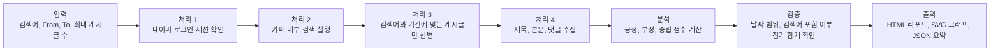
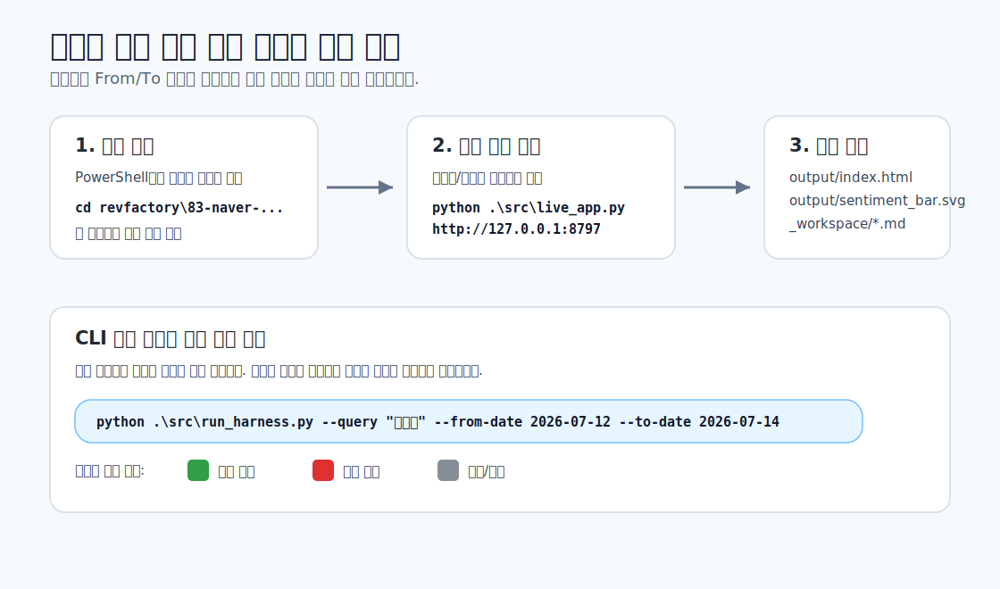

# 네이버 카페 검색어 반응 분석 하네스

## 하네스 주제

네이버 카페 [아프니까 사장이다](https://cafe.naver.com/jihosoccer123)에서 사용자가 입력한 검색어와 기간을 기준으로 게시글 제목, 본문, 댓글을 수집하고, 해당 기간의 반응이 긍정적인지 부정적인지 분석해 시각화하는 Codex용 AI Agent 하네스입니다.

예를 들어 `직접대출`, `신용취약` 같은 검색어와 `From`, `To` 날짜를 입력하면 해당 기간의 검색 결과를 수집한 뒤 기간 전체 결과와 일자별 결과를 함께 보여줍니다.

## 구성 목적

이 하네스는 단순한 스크래핑 코드가 아니라 AI Agent가 업무를 처리하는 흐름을 구현한 예시입니다.

핵심 목적은 다음과 같습니다.

- 사용자가 검색어와 기간을 입력하면 실제 네이버 카페에서 데이터를 새로 수집한다.
- 검색 결과 목록에서 입력 기간에 해당하는 게시글만 선별한다.
- 게시글 제목, 본문, 댓글을 바탕으로 긍정, 부정, 중립 반응을 분석한다.
- 기간 전체 결과와 일자별 결과를 HTML 리포트와 SVG 그래프로 출력한다.
- `_workspace/` 파일에 입력, 수집, 분석, 시각화, 검증, 출력 단계가 남도록 한다.

## 전체 구조

```text
83-naver-cafe-sentiment-harness/
├─ AGENTS.md
├─ README.md
├─ RESULT_REPORT.md
├─ requirements.txt
├─ .codex/
│  └─ skills/
│     └─ naver-cafe-sentiment/
│        └─ SKILL.md
├─ data/
│  └─ sample_posts.json
├─ docs/
│  └─ run-guide.svg
├─ src/
│  ├─ collector.py
│  ├─ live_app.py
│  ├─ renderer.py
│  ├─ run_harness.py
│  └─ sentiment.py
├─ _workspace/
│  ├─ 00_input.md
│  ├─ 01_data_collection.md
│  ├─ 01_collected_posts.json
│  ├─ 02_analysis_report.md
│  ├─ 02_sentiment_analysis.json
│  ├─ 03_visualization_spec.md
│  ├─ 04_output_report.md
│  └─ 05_validation_report.md
└─ output/
   ├─ index.html
   ├─ sentiment_bar.svg
   └─ sentiment_summary.json
```

## 입력 → 처리 → 검증 → 출력 흐름



### 단계별 산출물

- 입력: `_workspace/00_input.md`
- 수집: `_workspace/01_data_collection.md`, `_workspace/01_collected_posts.json`
- 분석: `_workspace/02_analysis_report.md`, `_workspace/02_sentiment_analysis.json`
- 시각화 명세: `_workspace/03_visualization_spec.md`
- 출력 요약: `_workspace/04_output_report.md`
- 검증: `_workspace/05_validation_report.md`
- 최종 결과: `output/index.html`, `output/sentiment_bar.svg`, `output/sentiment_summary.json`

## 주요 기능

- 네이버 로그인 세션 기반 실제 카페 검색
- 검색어 주변 텍스트가 있는 검색 결과만 수집
- 검색 결과 목록의 작성일 기준 기간 필터링
- 상세 페이지에서 검색어가 확인되지 않는 글 제외
- 날짜를 판독하지 못한 글 제외
- 기간 전체 감성 분석
- 일자별 감성 분석
- 긍정 우세는 초록색, 부정 우세는 빨간색, 중립/혼합은 회색으로 표시

## 설치

라이브 수집은 Playwright 브라우저 자동화를 사용합니다.

```powershell
pip install -r requirements.txt
python -m playwright install chromium
```

## 사용 방법 1: 로컬 입력 화면

검색어와 기간을 화면에서 입력하려면 다음 명령을 실행합니다.

```powershell
python .\src\live_app.py
```

터미널에 표시되는 주소를 브라우저에서 엽니다.

```text
http://127.0.0.1:8797
```

다른 로컬 앱이 이미 포트를 사용 중이면 `8798`, `8799`처럼 다른 포트가 자동으로 선택됩니다. 이 경우 터미널에 실제 출력된 주소를 열면 됩니다.

입력 화면에서 다음 값을 넣고 실행합니다.

- 검색어: 예시 `직접대출`
- From: 예시 `2026-07-05`
- To: 예시 `2026-07-07`
- 최대 게시글: 예시 `30`



## 사용 방법 2: CLI 실행

CLI에서 바로 실행하려면 다음처럼 입력합니다.

```powershell
python .\src\run_harness.py --query "직접대출" --from-date 2026-07-05 --to-date 2026-07-07 --max-posts 30
```

다른 검색어 예시:

```powershell
python .\src\run_harness.py --query "신용취약" --from-date 2026-07-12 --to-date 2026-07-14 --max-posts 30
```

첫 실행 시 네이버 로그인 창이 열릴 수 있습니다. 브라우저에서 로그인하면 세션이 저장되고, 이후 실행에서는 저장된 세션을 사용합니다.

로그인을 다시 하고 싶으면 `--force-login`을 붙입니다.

```powershell
python .\src\run_harness.py --query "신용취약" --from-date 2026-07-12 --to-date 2026-07-14 --max-posts 30 --force-login
```

## 샘플 모드

실제 네이버 카페에 접속하지 않고 하네스 흐름만 빠르게 확인하려면 `--sample`을 사용합니다.

```powershell
python .\src\run_harness.py --query "신용취약" --from-date 2026-07-12 --to-date 2026-07-14 --sample
```

샘플 모드는 실제 네이버 데이터가 아니라 검증용 예시 데이터입니다. 실제 결과를 보려면 `--sample`을 빼고 실행해야 합니다.

## 실행 결과 예시

CLI 실행이 끝나면 다음과 같은 메시지가 출력됩니다.

```text
하네스 실행 완료
- 기간: 2026-07-05 ~ 2026-07-07
- 실행 모드: live
- 우세 반응: 중립/혼합
- HTML: ...\output\index.html
- SVG: ...\output\sentiment_bar.svg
- 검증: ...\_workspace\05_validation_report.md
```

결과 파일은 다음 위치에서 확인합니다.

- `output/index.html`: 최종 HTML 리포트
- `output/sentiment_bar.svg`: 기간 전체 감성 가로바 그래프
- `output/sentiment_summary.json`: 기간 전체와 일자별 분석 JSON
- `_workspace/05_validation_report.md`: 실행 검증 결과

## 검증 기준

하네스는 실행 후 다음 항목을 검증합니다.

- 게시글 수집 여부
- 긍정, 부정, 중립 카운트 합계가 전체 게시글 수와 일치하는지
- 일자별 게시글 합계가 기간 전체 게시글 수와 일치하는지
- 입력 기간의 모든 날짜가 일자별 섹션으로 생성됐는지
- HTML, SVG, JSON 출력 파일이 생성됐는지
- 검색어가 상세 내용에서 확인되지 않는 글이 제외됐는지
- 기간 밖 게시글이 제외됐는지

## 한계와 확장 지점

- 네이버 카페 UI 구조가 바뀌면 `src/collector.py`의 선택자 조정이 필요할 수 있습니다.
- 현재 감성 분석은 투명한 키워드 점수 기반입니다. 더 정교한 분석이 필요하면 `src/sentiment.py`를 LLM 또는 별도 감성 모델로 확장할 수 있습니다.
- 비공개 게시글, 권한이 없는 게시판, 추가 인증이 필요한 경우 수집이 제한될 수 있습니다.
- 실제 사용 시 네이버 이용약관과 카페 운영 정책을 준수해야 합니다.
