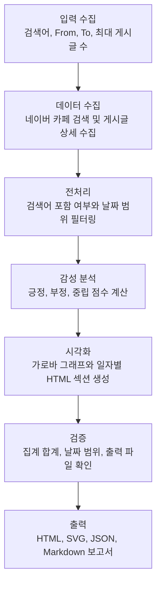

# 결과보고서: 네이버 카페 검색어 반응 분석 하네스

## 1. 프로젝트 개요

본 프로젝트는 네이버 카페에서 특정 검색어에 대한 기간별 반응을 수집하고 감성 분석 결과를 시각화하는 Codex용 AI Agent 하네스입니다.

대상 카페는 `https://cafe.naver.com/jihosoccer123`이며, 사용자는 검색어와 `From`, `To` 날짜를 입력해 해당 기간의 게시글 제목, 본문, 댓글 반응을 분석할 수 있습니다.

## 2. 개발 목적

과제의 핵심 요구사항은 AI Agent가 업무를 처리하는 구조를 설계하고, `입력 → 처리 → 검증 → 출력` 흐름이 드러나는 하네스를 구현하는 것입니다.

이를 위해 본 하네스는 다음 구조를 갖도록 구현했습니다.

- 입력값을 `_workspace/00_input.md`에 정리
- 네이버 카페에서 검색어와 기간에 맞는 게시글 수집
- 제목, 본문, 댓글 기반 감성 분석
- 기간 전체와 일자별 결과 생성
- 검증 보고서 작성
- HTML, SVG, JSON 결과물 출력

## 3. 전체 구조

```text
83-naver-cafe-sentiment-harness/
├─ README.md
├─ RESULT_REPORT.md
├─ AGENTS.md
├─ requirements.txt
├─ .codex/skills/naver-cafe-sentiment/SKILL.md
├─ src/
│  ├─ collector.py
│  ├─ live_app.py
│  ├─ renderer.py
│  ├─ run_harness.py
│  └─ sentiment.py
├─ data/sample_posts.json
├─ docs/run-guide.svg
├─ _workspace/
└─ output/
```

## 4. Agent 처리 흐름



## 5. 구현 내용

### 입력

사용자는 로컬 입력 화면 또는 CLI에서 검색어와 기간을 입력합니다.

예시:

```powershell
python .\src\run_harness.py --query "직접대출" --from-date 2026-07-05 --to-date 2026-07-07 --max-posts 30
```

### 처리

`src/collector.py`는 Playwright를 이용해 네이버 카페에 접근하고 검색을 수행합니다.

처리 과정에서 다음 필터를 적용했습니다.

- 검색어 주변 텍스트가 있는 검색 결과만 수집
- 검색 결과 목록의 작성일 기준으로 기간 필터링
- 같은 게시글의 댓글 링크 중복 제거
- 상세 페이지에 검색어가 없는 글 제외
- 날짜를 판독하지 못한 글 제외

### 분석

`src/sentiment.py`는 제목, 본문, 댓글의 감성 키워드를 기반으로 게시글별 점수를 계산합니다.

- 점수 2 이상: 긍정
- 점수 -2 이하: 부정
- 그 외: 중립

기간 전체 집계와 일자별 집계를 동시에 생성합니다.

### 검증

`_workspace/05_validation_report.md`에는 다음 검증 결과가 기록됩니다.

- 전체 게시글 수와 감성 분류 합계 일치 여부
- 일자별 게시글 합계와 전체 게시글 수 일치 여부
- 날짜 구간 생성 여부
- HTML, SVG, JSON 출력 파일 생성 여부
- 경고 또는 제한사항

### 출력

최종 결과는 다음 파일로 출력됩니다.

- `output/index.html`: 기간 전체와 일자별 분석 리포트
- `output/sentiment_bar.svg`: 기간 전체 감성 가로바 그래프
- `output/sentiment_summary.json`: 분석 결과 원본 JSON
- `_workspace/*.md`: 단계별 작업 보고서

## 6. 실행 예시

### 로컬 입력 화면 실행

```powershell
python .\src\live_app.py
```

브라우저에서 터미널에 표시된 주소를 열고 검색어, From, To를 입력합니다.

기본 주소:

```text
http://127.0.0.1:8797
```

### CLI 실행

```powershell
python .\src\run_harness.py --query "신용취약" --from-date 2026-07-12 --to-date 2026-07-14 --max-posts 30
```

### 실행 결과 예시

```text
하네스 실행 완료
- 기간: 2026-07-12 ~ 2026-07-14
- 실행 모드: live
- 우세 반응: 긍정 우세
- HTML: ...\output\index.html
- SVG: ...\output\sentiment_bar.svg
- 검증: ...\_workspace\05_validation_report.md
```

## 7. 결과 화면 구성

`output/index.html`은 다음 정보를 제공합니다.

- 전체 게시글 수
- 전체 댓글 수
- 우세 반응
- 우세 비율
- 기간 전체 가로바 그래프
- 일자별 긍정, 부정, 중립 결과
- 게시글별 판정 결과와 근거 키워드

그래프 색상 규칙:

- 긍정 우세: 초록색
- 부정 우세: 빨간색
- 중립 또는 혼합: 회색

## 8. 검증 및 개선 사항

개발 중 확인한 문제와 개선 사항은 다음과 같습니다.

- 검색 결과 페이지의 추천 글과 전체 글 링크가 섞이는 문제를 검색어 주변 텍스트 필터로 해결
- 댓글 검색 결과가 우선 잡히는 문제를 게시글 검색 모드로 강제해 완화
- 제목 안의 날짜 문구를 게시일로 오인하는 문제를 작성일 행 기준 필터로 개선
- 기간 밖 게시글이 결과에 포함되는 문제를 목록 단계와 상세 단계에서 이중 필터링
- 같은 게시글의 댓글 링크 중복 수집 문제를 article id 기준 중복 제거로 해결

## 9. 한계

- 네이버 카페 UI가 변경되면 수집 선택자 조정이 필요할 수 있습니다.
- 로그인 권한이 없는 게시글은 수집이 제한될 수 있습니다.
- 현재 감성 분석은 규칙 기반이므로 문맥을 완벽히 이해하지는 못합니다.
- 더 정교한 분석을 위해 LLM 기반 감성 분류 또는 도메인 맞춤 감성 사전을 추가할 수 있습니다.

## 10. 결론

본 하네스는 사용자의 검색어와 기간 입력을 기반으로 실제 네이버 카페 데이터를 수집하고, 감성 분석과 검증을 거쳐 결과물을 생성하는 AI Agent 업무 처리 구조를 구현했습니다.

특히 `_workspace/`에 단계별 산출물을 남겨 `입력 → 처리 → 검증 → 출력` 흐름을 확인할 수 있으며, 최종 사용자는 `output/index.html`에서 기간 전체와 일자별 반응을 직관적으로 확인할 수 있습니다.
